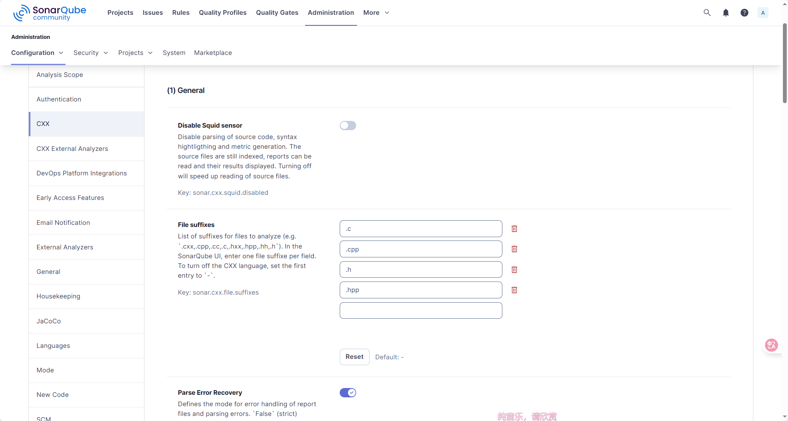

# SonarQube 配置文档汇总

## 📁 文档列表

### 1. README.md

**主要文档** - 包含完整的配置和使用说明

- 系统信息和版本
- 部署架构说明
- 详细配置说明
- 使用指南
- 项目扫描配置
- 常见问题解答

### 2. docker-compose.yaml

- **Docker Compose 配置文件**

- SonarQube 服务配置
- PostgreSQL 数据库配置
- 网络和存储配置

### 3. sonar-project.properties.example

- **项目配置文件模板**

- 项目基本信息配置
- 源代码目录配置
- C/C++ 插件配置
- 包含详细注释说明

### 4. sonar-scan-example.sh

- **扫描脚本示例**

- 使用 Docker 运行 SonarScanner
- 包含完整的参数配置
- 可直接在项目中使用

### 5. COMMANDS.md

- **快速命令参考**

- 服务管理命令
- 日志查看命令
- 状态检查命令
- 故障排查命令
- 性能优化建议

---

## 🚀 快速开始

### 0. 环境准备

编辑 /etc/sysctl.conf：

sudo vim /etc/sysctl.conf

加入：

vm.max_map_count=262144

使设置生效：

sudo sysctl -p

### 1. 启动 SonarQube

```bash
cd /opt/sonarqube
mkdir -p postgresql
mkdir -p sonarqube
chmod 777 -R postgresql
chmod 777 -R sonarqube
docker compose up -d
```

### 2. 访问 Web 界面

<http://localhost:9000>

### 3. 配置 CXX 插件

```bash
mkdir -p sonarqube/extensions/plugins/
cp sonar-cxx-plugin-2.2.2.1350.jar sonarqube/extensions/plugins/
docker-compose restart
```

访问: <http://localhost:9000/admin/settings?category=cxx>
设置 File suffixes: `.cxx,.cpp,.cc,.c,.hxx,.hpp,.hh,.h`


### 4. 生成扫描 Token

访问: <http://localhost:9000/account/security>

### 5. 配置项目

复制 `sonar-project.properties.example` 到项目根目录，重命名为 `sonar-project.properties`

### 6. 运行扫描

```bash
cd /path/to/project
docker run --rm \
  --user root \
  -v "$(pwd):/usr/src" \
  -e SONAR_HOST_URL=http://YOUR_HOST_IP:9000 \
  -e SONAR_TOKEN=your_token \
  sonarsource/sonar-scanner-cli:latest
```

---

## 📌 重要提示

### ⚠️ CXX 插件配置

**最常见问题**: File suffixes 第一个值被设置为 `-`

- ❌ 错误: `-,.cpp,.c` (会禁用 CXX 支持)
- ✅ 正确: `.cxx,.cpp,.cc,.c,.hxx,.hpp,.hh,.h`

### 🔑 认证信息

- 默认管理员账号: `admin/admin`
- 首次登录需要修改密码
- 建议为扫描创建专用 Token

### 💾 数据备份

定期备份以下目录:

- `/opt/sonarqube/postgresql/data/` (数据库)
- `/opt/sonarqube/sonarqube/data/` (SonarQube 数据)

---

## 🔗 相关链接

- SonarQube 官方文档: <https://docs.sonarsource.com/sonarqube/>
- CXX 插件仓库: <https://github.com/SonarOpenCommunity/sonar-cxx>
- Docker Hub: <https://hub.docker.com/_/sonarqube>

---

**文档创建日期**: 2025-12-10  
**SonarQube 版本**: 25.11.0.114957  
**维护人**: liuyijie
